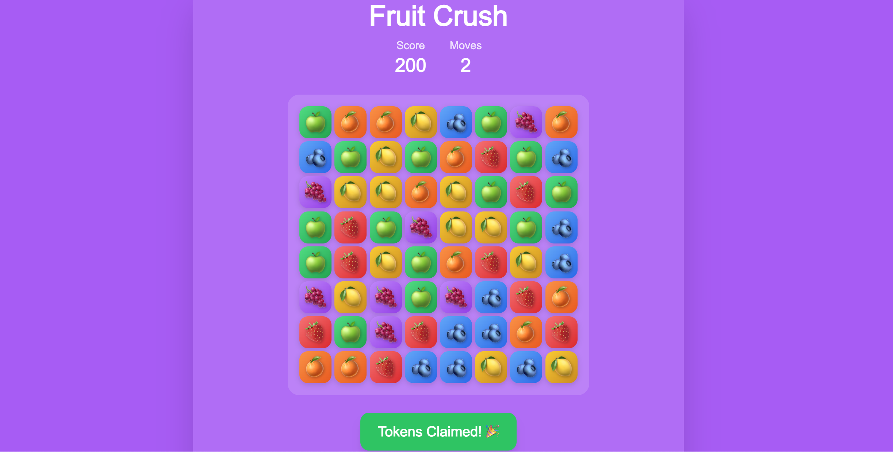

# 🍎 Fruit Crush - Web3 Match-3 Game

A modern, blockchain-integrated match-3 puzzle game built with Next.js, React, and Web3 technologies. Players can earn tokens by making successful moves in this Candy Crush-style game deployed on the Celo blockchain.




## 🛠️ Technology Stack

### Frontend
- **Next.js 14**: React framework with App Router
- **React 18**: Component-based UI with hooks
- **TypeScript**: Type-safe development
- **Tailwind CSS**: Utility-first styling
- **Radix UI**: Accessible component primitives

### Web3 & Blockchain
- **Thirdweb v5**: Web3 development platform
- **Ethers.js 6**: Ethereum library for blockchain interactions
- **Celo Network**: Carbon-negative blockchain for transactions
- **ERC-20 Tokens**: Standard token implementation

### Development Tools
- **ESLint**: Code linting and formatting
- **PostCSS**: CSS processing
- **Autoprefixer**: CSS vendor prefixing
- **pnpm**: Fast package manager

## 🚀 Getting Started

### Prerequisites
- Node.js 18+ 
- pnpm (recommended) or npm
- A Web3 wallet (MetaMask, WalletConnect, etc.)
- Celo network configured in your wallet

### Installation

1. **Clone the repository**
   ```bash
   git clone <repository-url>
   cd fruit-crush
   ```

2. **Install dependencies**
   ```bash
   pnpm install
   # or
   npm install
   ```

3. **Configure environment variables**
   Create a `.env.local` file in the root directory:
   ```env
   NEXT_PUBLIC_THIRDWEB_CLIENT_ID=your_thirdweb_client_id
   NEXT_PUBLIC_CONTRACT_ADDRESS=0xb6585f51d25Af8D48b0995B1eb110df6a3Bf5912
   NEXT_PUBLIC_CHAIN_ID=42220
   ```

4. **Start the development server**
   ```bash
   pnpm dev
   # or
   npm run dev
   ```

5. **Open your browser**
   Navigate to [http://localhost:3000](http://localhost:3000)

### Building for Production

```bash
pnpm build
pnpm start
```

## 🔗 Smart Contract Integration

### Contract Details
- **Network**: Celo Mainnet (Chain ID: 42220)
- **Contract Address**: `0xb6585f51d25Af8D48b0995B1eb110df6a3Bf5912`
- **Token Standard**: ERC-20 with minting capabilities
- **RPC Endpoint**: `https://forno.celo.org`

### Key Functions
- `mintTo(address, amount)`: Mints tokens to specified address
- `balanceOf(address)`: Returns token balance
- `transfer(from, to, amount)`: Transfers tokens between addresses


## 🐛 Troubleshooting

### Common Issues

**Wallet Connection Problems**
- Ensure you're on the Celo network
- Check that your wallet supports Celo
- Verify the contract address is correct

**Transaction Failures**
- Check your CELO balance for gas fees
- Ensure the contract has minting permissions
- Try increasing gas limit if transactions fail

**Game Performance**
- Close other browser tabs
- Check browser console for errors
- Ensure hardware acceleration is enabled

### Debug Mode
Enable debug logging by adding to your browser console:
```javascript
localStorage.setItem('debug', 'true');
```

## 🤝 Contributing

1. Fork the repository
2. Create a feature branch (`git checkout -b feature/amazing-feature`)
3. Commit your changes (`git commit -m 'Add amazing feature'`)
4. Push to the branch (`git push origin feature/amazing-feature`)
5. Open a Pull Request

## 📄 License

This project is licensed under the MIT License - see the [LICENSE](LICENSE) file for details.

## 🙏 Acknowledgments
- **Celo** for carbon-negative blockchain
- **Next.js** team for the amazing framework
- **Tailwind CSS** for utility-first styling
- **Radix UI** for accessible components

## 📞 Support

If you encounter any issues or have questions:
- Open an issue on GitHub
- Check the troubleshooting section
- Review the smart contract documentation

---

**Happy Gaming! 🎮✨**

*Built with ❤️ for the Web3 gaming community*
